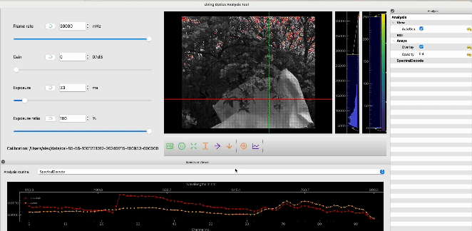

# Python examples

Python code examples showcasing the application of spectral information to computer vision tasks.

These examples use the [Living Optics SDK](https://www.livingoptics.com/developer/).

- 📹 + 🌈 Experience the utility of video-rate spatial-spectral imaging combined with real-time analysis capabilities.
- 🔧 + 👩‍💻 Access developer-friendly tools that integrate with computer vision workflows.
- 🪢 + 💪🏼 Leverage the power of merging RGB and hyperspectral data for superhuman analysis.

## Getting started

- New to this repository? : Please read the [Getting started guide](https://developer.livingoptics.com/getting-started/)
- Register to download the SDK and sample data [here](https://www.livingoptics.com/register-for-download-sdk/)
- Registered as a user? Read the [documentation](https://docs.livingoptics.com/)
- Take me to the [examples](#examples)

## Resources

- [Developer documentation](https://developer.livingoptics.com/)
- [Developer resources](https://www.livingoptics.com/developer)
- [Product documentation](https://docs.livingoptics.com/) for registered users.

## Examples

For more details on an example, click on any of the images or GIFs below. Full [listing](#examples-listing) below.

Spectral detection | Spectrally enhanced object detection |
:------------: |  :----------: |
  |   |

Dimensionality reduction (Fruit bruise ID) | NDVI Spectral index (Plant health - NDVI) |
:------------: |  :----------: |
  |  |

## Examples listing

All examples require an install of the LO python SDK within a python virtual enviroment for details see the [install guide](https://docs.livingoptics.com/sdk/install-guide.html#custom-python-environment). 

Note: this requires registration see [getting started](#getting-started) for details

Example | About | Data samples |
:--------------------|:--------------------------------------|:-------|
[Spectral detection](./spectral-detection/README.md) | Example of how run a simple sklearn classifier on spectral data and visualise the result. | [data](https://cloud.livingoptics.com/shared-resources?file=samples/spectral-detection.zip)|
[Spectrally enhanced object detection](./enhanced-object-detection/README.md) | Example of how LO's spectral information and be used to improve object detectors such as YOLO and SSD. | [data](https://cloud.livingoptics.com/shared-resources?file=samples/enhanced-object-detection.zip) |
[Dimensionality reduction](./dimensionality-reduction/README.md) | Performing dimensionality reduction techniques such as PCA and LDA on spatial spectral data. | [data](https://cloud.livingoptics.com/shared-resources?file=samples/bruised-apple.zip)|
[NDVI spectral index](./NDVI/README.md) | Example of performing NDVI with irradiance using LO's SDK, this techique is typically used to assess plant health. | [data](https://cloud.livingoptics.com/shared-resources?file=samples/NDVI.zip)|

## Analysis tool plugins

The [analysis tool](https://docs.livingoptics.com/sdk/tools/analysis/tool-guide.html) supports user written analysis routines to enable developers to rapidly prototype there own applications with the SDK. 

  

### Details on the set anaylsis plugin examples can be [found here](./analysis-plugins/README.md).

Routine | About | Data samples |
:-------------------------|:----------------------|:-------------|
| [Single band](./analysis-plugins/routines/single_band.py)  | The intensity of a wavelength (nearest) or range of wavelengths | [data](https://cloud.livingoptics.com/shared-resources?file=samples/ndvi.zip) |
| [Band ratio](./analysis-plugins/routines/band_ratio.py)  | A band ratio is a simply a quotient of some select bands in a spectrum, which produces a single value each spectral sample. Different band ratios allows the extraction of different properties | [data](https://cloud.livingoptics.com/shared-resources?file=samples/bruised-apple.zip) |
| [Principal Component Analysis](./analysis-plugins/routines/pca.py) | PCA is an algorithm for dimensionality reduction and is typically used for data preprocessing and exploration. This analysis plugin allows you to display the components one-by-one using an overlay on the image | [data](https://cloud.livingoptics.com/shared-resources?file=samples/macbeth.zip) |
| [K-means Clustering](./analysis-plugins/routines/kmeans.py) |  K-means is an unsupervised learning method, where it assigns a each spectral datapoint to one of K classes | [data](https://cloud.livingoptics.com/shared-resources?file=samples/macbeth.zip) | 
| [Mean-shift clustering](./analysis-plugins/routines/mean_shift.py) | Mean shift clustering is another unsupervised learning algorithm. It is centroid based and the user does not need to choose the number of clusters. | [data](https://cloud.livingoptics.com/shared-resources?file=samples/macbeth.zip) |
| [Anomaly detection](./analysis-plugins/routines/rxd.py) | The Red-Xiaoli detection script compares the statistics of each spectral point with the background (the average of the entire image). | [data](https://cloud.livingoptics.com/shared-resources?file=samples/anomaly-detection.zip) | 
| [MCARI](./analysis-plugins/routines/mcari.py) | MCARI (Modified Chlorophyll Absorption in Reflectance Index) is calculated using green, red and near-infrared (NIR) wavelengths. | [data](https://cloud.livingoptics.com/shared-resources?file=samples/tree-with-blossoms.zip) |

## Integrations with third parties:

Routine | About |
:-------------------------|:----------------------|
|[Jetson inference](./integrations/jetson/README.md) | Integrations of popular jetson libaries with the Living Optics camera with application examples that utilising the libaries |
[Jupyter notebooks](./integrations/jupyter/README.md) | Integration with Jupyter contains examples and talk throughs of the LO SDK with Jupyter notebooks |

### More coming soon 💪🏼

