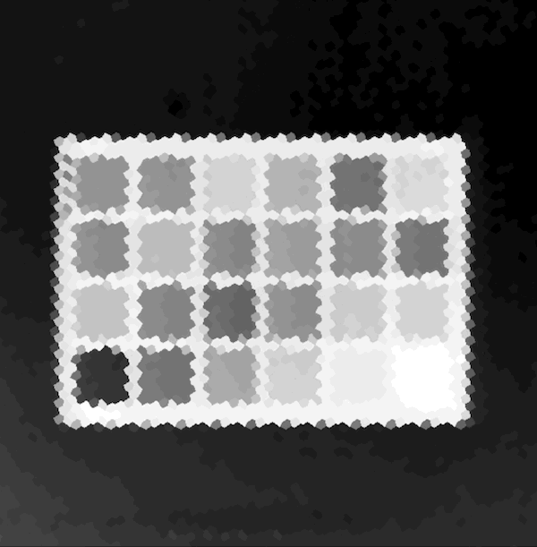

# Python examples

Python code examples showcasing the application of spectral information to enhance computer vision tasks.

These examples use the [Living Optics SDK](https://www.cloud.livingoptics.com/shared-resources?file=software/lo_sdk-1.6.0-dist.tgz).

- 📹 + 🌈 Experience the utility of video-rate spatial-spectral imaging combined with real-time analysis capabilities.
- 🔧 + 👩‍💻 Access developer-friendly tools that integrate with computer vision workflows.
- 🪢 + 💪🏼 Leverage the power of merging RGB and hyperspectral data for superhuman analysis.

## Getting started

- New to this repository? : Please read the [Getting started guide](https://developer.livingoptics.com/getting-started/)
- Register to download the SDK and sample data [here](https://www.cloud.livingoptics.com/register)
- Registered as a user on the Basic tier or higher? Read the full [documentation](https://docs.livingoptics.com/)
- Take me to the [examples](#examples)

## Resources

- [Developer resources](https://developer.livingoptics.com/)
- [Product documentation](https://docs.livingoptics.com/) for registered users on the Basic tier.

## Examples

All examples require an install of the Living Optics SDK within a python virtual environment. For details see the [install guide](https://cloud.livingoptics.com/shared-resources?file=docs/ebooks/install-sdk.pdf).

For more details on an example, click on any of the images or GIFs below. Full listings in the table below.

|                                                                                      Spectral detection                                                                                      |                                                                                             Spectrally enhanced object detection                                                                                             |
|:--------------------------------------------------------------------------------------------------------------------------------------------------------------------------------------------:|:----------------------------------------------------------------------------------------------------------------------------------------------------------------------------------------------------------------------------:|
|                                                       |                                                                                          |
|                                                                          NDVI Spectral index (Plant health - NDVI)                                                                           |                                                                                          Segmentation with Spectral Classification                                                                                           |
|  |                                                     |
|                                                                                   Dimensionality Reduction                                                                                   |                                                                                  Working with Living Optics datasets                                                                                   |
|                                  | ) |

| Example                                                                                                                                                              | About                                                                                                                                                                                           | Data samples                                                                                          |
|:---------------------------------------------------------------------------------------------------------------------------------------------------------------------|:------------------------------------------------------------------------------------------------------------------------------------------------------------------------------------------------|:------------------------------------------------------------------------------------------------------|
| [Spectral detection](./applications/spectral-detection/README.md)                                                                                                    | Example of how run a simple sklearn classifier on spectral data and visualise the result.                                                                                                       | [data](https://cloud.livingoptics.com/shared-resources?file=samples_v2/spectral-detection.zip)        |
| [Spectrally enhanced object detection](./applications/enhanced-object-detection/README.md)                                                                           | Example of how Living Optics spectral information can be used to improve object detectors such as YOLO and SSD.                                                                                 | [data](https://cloud.livingoptics.com/shared-resources?file=samples_v2/enhanced-object-detection.zip) |
| [NDVI spectral index](https://github.com/livingoptics/sdk-examples/blob/929cbe85edcf5119eab7632e626b71f86102ab11/src/python/examples/applications/NDVI_from_file.py) | Example of performing NDVI with irradiance using the Living Optics SDK, this technique is typically used to assess plant health.                                                                | [data](https://cloud.livingoptics.com/shared-resources?file=samples_v2/getting-started-analysis.zip)  |
| [Segmentation with Spectral Classification](https://github.com/livingoptics/spatial-spectral-ml/tree/main)                                                           | Example of spectral classifier trained on minimal data integrated into a semantic segmentation pipeline, enabling subclass recognition of objects beyond the capabilities of standard RGB data. | [data](https://huggingface.co/datasets/LivingOptics/hyperspectral-fruit)                              |
| [Dimensionality Reduction](./applications/dimensionality-reduction/README.md)                                                                                        | Performing dimensionality reduction techniques such as PCA and LDA on spatial spectral data.                                                                                                    | [data](https://cloud.livingoptics.com/shared-resources?file=samples_v2/macbeth.zip)                   |
| [Supervised learning with datasets from the Living Optics Data Exploration Tool ](./integrations/working-with-datasets/README.md)                                    | Example of working with a larger dataset for supervised detection and regression workflows.                                                                                                     | [data](https://cloud.livingoptics.com/shared-resources?file=annotated-datasets/Grapes-Dataset.zip)    |

## Analysis tool plugins

The [analysis tool](https://docs.livingoptics.com/sdk/tools/analysis/tool-guide.html) supports custom analysis routines to enable developers to rapidly prototype their own applications with the SDK. 

  

### Details on the set anaylsis plugin examples can be [found here](./analysis-plugins/README.md).

| Routine                                                            | About                                                                                                                                                                                                              | Data samples                                                                        |
|:-------------------------------------------------------------------|:-------------------------------------------------------------------------------------------------------------------------------------------------------------------------------------------------------------------|:------------------------------------------------------------------------------------|
| [Single band](./analysis-plugins/routines/single_band.py)          | The intensity of a wavelength (nearest) or range of wavelengths.                                                                                                                                                   | [data](https://cloud.livingoptics.com/shared-resources?file=samples_v2/macbeth.zip) |
| [Band ratio](./analysis-plugins/routines/band_ratio.py)            | A band ratio is a simply a quotient of select bands in a spectrum, which produces a single value for each spectral sample. Different band ratios allows the extraction of different properties.                    | [data](https://cloud.livingoptics.com/shared-resources?file=samples_v2/macbeth.zip) |
| [Principal Component Analysis](./analysis-plugins/routines/pca.py) | PCA is an algorithm for dimensionality reduction and is typically used for data preprocessing and exploration. This analysis plugin allows you to display the components one-by-one using an overlay on the image. | [data](https://cloud.livingoptics.com/shared-resources?file=samples_v2/macbeth.zip) |
| [K-means Clustering](./analysis-plugins/routines/kmeans.py)        | K-means is an unsupervised learning algorithm, where it assigns a spectral datapoint to one of K classes.                                                                                                          | [data](https://cloud.livingoptics.com/shared-resources?file=samples_v2/macbeth.zip) | 
| [Mean-shift clustering](./analysis-plugins/routines/mean_shift.py) | Mean shift clustering is another unsupervised learning algorithm. It is centroid based and the user does not need to choose the number of clusters.                                                                | [data](https://cloud.livingoptics.com/shared-resources?file=samples_v2/macbeth.zip) |
| [Anomaly detection](./analysis-plugins/routines/rxd.py)            | The Red-Xiaoli detection script compares the statistics of each spectral point with the background (the average of the entire image).                                                                              | No data                                                                             | 

## Integrations with third parties:

| Routine                                               | About                                                                                                       |
|:------------------------------------------------------|:------------------------------------------------------------------------------------------------------------|
| [Jetson inference](./integrations/jetson/README.md)   | Integrations of popular jetson libaries with application examples using the Living Optics Camera            |
| [Jupyter notebooks](./integrations/jupyter/README.md) | Integration with Jupyter contains examples and walkthroughs of the Living Optics SDK with Jupyter notebooks |

## Scripts and processing examples:

| Script                                                             | About                                                                                                      | Prerequisites                                                                                                                                                    |
|:-------------------------------------------------------------------|:-----------------------------------------------------------------------------------------------------------|:-----------------------------------------------------------------------------------------------------------------------------------------------------------------|
| [Convert lo format scene view to mp4](./scripts/lo_to_mp4.py)      | This script converts a `.lo` data stream to an mp4 video                                                   | [opencv-python](https://pypi.org/project/opencv-python/)                                                                                                         |
| [Run maskrcnn model with lo stream](./scripts/lo_with_maskrcnn.py) | This script runs an off-the-shelf maskrcnn model on the `.lo` data stream, with the required preprocessing | [opencv-python](https://pypi.org/project/opencv-python/)   [torch](https://pypi.org/project/torch/)   [torchvision](https://pypi.org/project/torchvision/) |

### More coming soon 💪🏼

## Contribution Guidelines
We welcome contributions to enhance this project. Please follow these steps to contribute:

**Fork the Repository**: Create a fork of this repository to your GitHub account.

**Create a Branch**: Create a new branch for your changes.
**Make Changes**: Make your changes and commit them with a clear and descriptive message.

**Create a Pull Request**: Submit a pull request with a description of your changes.

## Support

For any questions, contact us at [Living Optics support](https://www.livingoptics.com/support).