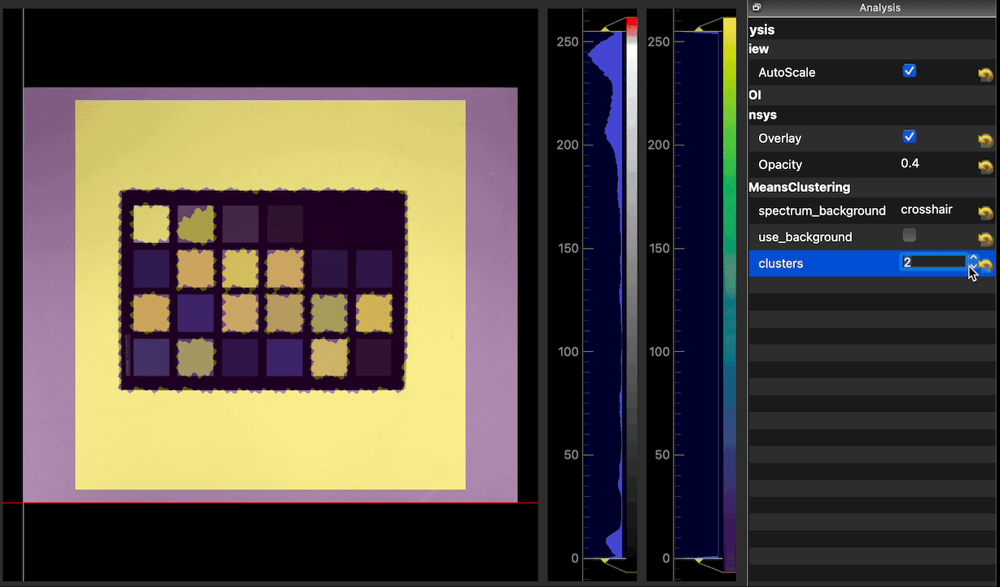

# Sample Analysis Tool Routines

This section contains examples of analysis routines which are compatible with the PYQT based [analysis tool](https://docs.livingoptics.com/sdk/tools/analysis/tool-guide.html).

## Preview

| Script                                             | Functionality                                    |
| -------------------------------------------------- | ------------------------------------------------ |
| [Single band](./routines/single_band.py)           |           |
| [Band ratio](./routines/band_ratio.py)             |             |
| [Principal Component Analysis](./routines/pca.py)  |  |
| [K-means Clustering](./routines/kmeans.py)         |         |
| [Mean-shift clustering](./routines/mean_shift.py)  |  |
| [Anomaly detection](./routines/rxd.py)             |         |

## Usage

### Installation

### SDK
1. You'll need to be first registered/logged in with our cloud service through [here](https://cloud.livingoptics.com/login)
2. Then download the SDK and follow the SDK install instructions found [here](https://cloud.livingoptics.com/shared-resources?file=docs/ebooks/install-sdk.pdf).

### To run

In a terminal window, activate the SDK virtual environment.

```bash
source /PATH/TO/ACTIVATE/VENV/BIN/ACTIVATE
```

- Add directory path to PYTHONPATH:

```bash
export PYTHONPATH="${PYTHONPATH}:/PATH/TO/LOCATION/OF/ANALYSIS/ROUTINE"
# export PYTHONPATH="${PYTHONPATH}:/home/seonghyun/venv/venv_github/lib/python3.12/site-packages/lo/sdk/tools/analysis"

```

Then run the `analysis` tool with the plugin:

```bash
analysis 
--analysis single_band.SingleBandAnalysis
--file /path/to/lo-file
```

## Example Scripts

- Single band
  - The intensity of a wavelength (nearest) or range of wavelengths.
  - Dataset example can be downloaded from [here](https://cloud.livingoptics.com/shared-resources?file=samples_v2/macbeth.zip).

```bash
analysis --analysis single_band.SingleBandAnalysis --file /datastore/lo/share/samples/macbeth.lo
```
> **Warning** the camera has fixed channel numbers and is therefore unable to differentiate arbitrary wavelengths to use as bands, despite the software plugin allowing user input like this. The software will display the closest channel to the chosen wavelength **only**.

- Band ratio script
  - A band ratio is a simply a quotient of some select bands in a spectrum, which produces a single value for each spectral sample.
  - Different band ratios allows the extraction of different properties.
  - We have chosen the 2-band ratio here as an example, where the value is R = (B1-B2)/(B1+B2).
  - Dataset example can be downloaded from [here](https://cloud.livingoptics.com/shared-resources?file=samples_v2/macbeth.zip).


```bash
analysis --analysis band_ratio.BandRatioAnalysisExample --file /datastore/lo/share/samples/macbeth.lo
```

> **Warning** the camera has fixed channel numbers and is therefore unable to differentiate arbitrary wavelengths to use as bands, despite the software plugin allowing user input like this. The software will display the closest channel to the chosen wavelength **only**.

- Principal Component Analysis (PCA)
  - PCA is an algorithm for dimensionality reduction and is typically used for data preprocessing and exploration.
  - High dimensional spectral data is re-projected into a coordinate space where the first few components capture the direction of 'greatest variance' within the dataset.
  - This analysis plugin allows you to display the channels one-by-one using an overlay on the image.
  - Dataset example can be downloaded from [here](https://cloud.livingoptics.com/shared-resources?file=samples_v2/macbeth.zip)

```bash
analysis --analysis pca.PrincipalComponentAnalysisExample --file /datastore/lo/share/macbeth/macbeth.lo
```

- K-means Clustering
  - K-means is an unsupervised learning method, where it assigns each spectral datapoint to one of K classes.
  - The user is able to choose the value of K. In this implementation it should be between 2-5.
  - The tool produces an overlay onto the image with the value of the label and the user can change the colour LUT by right-clicking on the colourbar to assign different colours to the classes.
  - Dataset example can be downloaded from [here](https://cloud.livingoptics.com/shared-resources?file=samples_v2/macbeth.zip)


```bash
analysis --analysis kmeans.KMeansClustering --file /datastore/lo/share/samples/macbeth/macbeth.lo
```

- Mean-shift Clustering
  - Mean-shift clustering is another unsupervised learning algorithm. It is centroid based and the user does not need to choose the number of clusters.
  - We can apply it to spectra to automatically group together 'similar' points.
  - Dataset example can be downloaded from [here](https://cloud.livingoptics.com/shared-resources?file=samples_v2/macbeth.zip)

```bash
analysis --analysis mean_shift.MeanShiftClusterer --file /datastore/lo/share/samples/macbeth/macbeth.lo
```

- RX anomaly detection
  - The Red-Xiaoli detection script compares the statistics of each spectral point with the background (the average of the entire image).
  - Assuming that the anomalous points are rare compared to the background, they will be highlighted via an overlay.
  - Dataset not available

```bash
analysis --analysis rxd.RxAnomalyDetector --file /datastore/lo/share/samples_v2/path_to_file.lo 
```