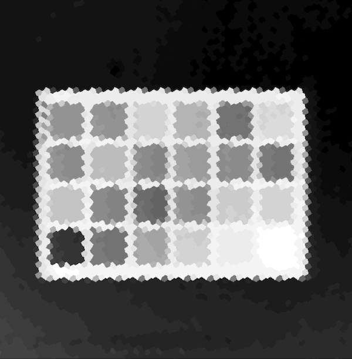

# Dimensionality Reduction

This example shows how to perform dimensionality reduction using Living Optics hyperspectral
data. The following techniques are implemented:

1. Principle Component Analysis (PCA)
2. Minimum Noise Fraction (MNF)
3. Linear Discriminant Analysis (LDA)

## Preview

This preview shows how PCA can used to identify different clusters on a macbeth chart.



## Prerequisites

- Have installed the Living Optics SDK as per the `Custom Python Environment` [install instructions](https://cloud.livingoptics.com/shared-resources?file=docs/ebooks/install-sdk.pdf).
- From within the SDK virtual environment, have installed these additional dependencies:

```bash
 pip install -r dr-requirements.txt
```

## Sample data

Sample data can be found
[here](https://cloud.livingoptics.com/shared-resources?file=samples_v2/macbeth.zip)

## Usage

### Script

```bash
python dimensionality_reduction.py
```

### User inputs

- filepath - enter the path to the `.lo` file
- frame_idx - selects the frame from an `.lo` file
- analysis_type - selects the analysis routine to run

Analysis is one of:

- "PCA" = Principle Component Analysis (PCA)
- "MNF" = Minimum Noise Fraction (MNF)
- "LDA" = Linear Discriminant Analysis (LDA)

### CLI usage

```bash
python dimensionality_reduction_cli.py --filepath /path/to/lo/file/data.lo --analysis-type 1
```

### Example PCA analysis:

```bash
python dimensionality_reduction_cli.py -f /datastore/lo/share/samples_v2/macbeth/
```

### Example for PCA Analysis on frame 0

```bash
python dimensionality_reduction_cli.py --filepath /datastore/lo/share/samples_v2/macbeth -at=PCA --frame-index 0
```

### Example for LDA Analysis on frame 3 in the data file

```bash
python dimensionality_reduction_cli.py -f /datastore/lo/share/samples_v2/macbeth/ -at LDA -i 3
```

### CLI tips

Once your device meets the software requirements -

- The `analysis-type` (_--analysis-type_ / _-at_) is where you need to specify which type of
  analysis you want to perform. (Mentioned in the **Introduction**)
- A window will pop up to for the user to select the Region of Interest (ROI) from the scene for
  White Reference and Background. Please select the brightest region for the White Reference and
  darkest for the Background using the mouse to draw ROI for each.
- **NOTE:** When you are performing LDA, another window will be shown to the user to select a region
  for the labels.
- Now, another window will pop up where you can see the result.