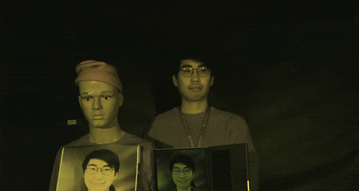
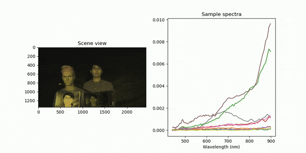
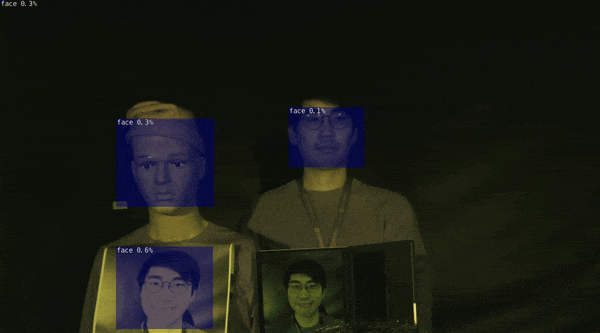
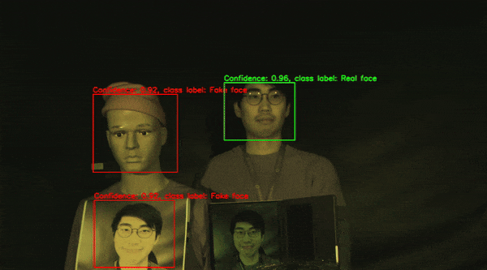

# Jetson inference integration

This contains integrations of popular jetson libaries with the Living Optics camera.

## Installation

### SDK

Visit [here](https://docs.livingoptics.com/sdk/install-guide.html) for instructions on how to install the SDK.

### jetson-inference and jetson-utils

Visit [here](https://github.com/dusty-nv/jetson-inference?tab=readme-ov-file#system-setup) for instructions on how to install jetson-inference which also installs jetson-utils as a submodule.

### Integrating Jetson libraries into the SDK venv

After installing jetson libraries, which installs it globally, run the following:

```sh
cd VENV_PATH/lib/python3.8/site-packages
ln -s /usr/lib/python3.8/dist-packages/jetson_utils_python.so .
ln -s /usr/lib/python3.8/dist-packages/jetson_utils .
ln -s /usr/lib/python3.8/dist-packages/jetson_inference_python.so .
ln -s /usr/lib/python3.8/dist-packages/jetson .
ln -s /usr/lib/python3.8/dist-packages/Jetson .
```

This will link symlinks to the jetson libraries to your python venv. Alternatively, you can create copies by replacing `ln -s` by `cp -r`.

## Examples

For more details on each example, click on any of the images or GIFs below.

Stream from camera | Stream to file decoded |
:------------: |  :----------: |
 |   |

Face detection | Face detection with Spectral filtering |
:------------: |  :----------: |
[](../jupyter/notebooks/face_detection.ipynb) | [](../jupyter/notebooks/face_detection_with_spectral_filtering.ipynb) |

Example | Python script |
:--------------------|:-------|
Stream from camera | - |
Face detection using jetson-inference | [Script](python/face_detection.py) |
Face detection with Spectral filtering using jetson-inference | [Script](python/face_detection_with_spectral_filtering.py) |